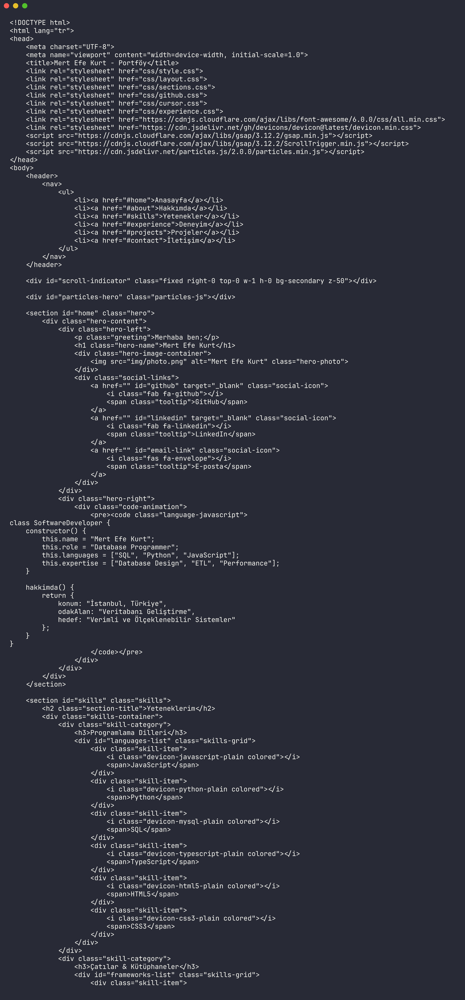

# Portfolio

<div align="center">


</div>

This repository contains the source for Mert Efe Kurt's personal portfolio website. It combines a Turkish single-page layout, animated UI sections, skills, experience, projects, contact links, and live GitHub activity widgets.



## Features

- Single-page portfolio layout
- Hero section with profile image and animated code block
- Skills, experience, projects, GitHub activity, and contact sections
- GSAP and ScrollTrigger animation hooks
- Particles background and custom cursor scripts
- GitHub API integration for repository stats and recent activity
- Static deployment support through `CNAME`

## Quick Start

```bash
git clone https://github.com/mertefekurt/portfolio.git
cd portfolio
python3 -m http.server 8000
```

Open:

```text
http://127.0.0.1:8000
```

## Project Structure

```text
index.html       Main page markup
css/             Layout, sections, cursor, stars, and GitHub styles
js/              Animations, config, GitHub API integration, and UI behavior
img/             Profile and project images
CNAME            Custom domain configuration
```

## Customization

Edit `js/config.js` to update profile metadata, skills, project cards, and experience entries. Update images in `img/` and deploy the static files to GitHub Pages or any static host.
